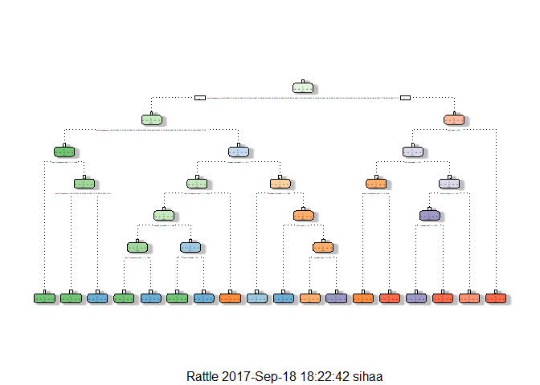

Overview
--------

This is the final project assignment for the course at coursera for
practical machine learning as part of the Data Science specialization.
In this project we will submit our final project and review our peers to
complete this course.

Objective
---------

The goal of this project is to predict the manner in which people did
the exercise. Using devices such as Jawbone Up, Nike FuelBand, and
Fitbit it is now possible to collect a large amount of data about
personal activity relatively inexpensively. These type of devices are
part of the quantified self movement - a group of enthusiasts who take
measurements about themselves regularly to improve their health, to find
patterns in their behavior, or because they are tech geeks.

One thing that people regularly do is quantify how much of a particular
activity they do, but they rarely quantify how well they do it. In this
project, we will use data from accelerometers on the belt, forearm, arm,
and dumbell of 6 participants.This is the "classe" variable in the
training set. We will create a report describing how you built model and
explain how we used cross validation with more details of our
decision.We will also use your prediction model to predict 20 different
test cases as part of the requirement.

Data
----

Human Activity Recognition - HAR - has emerged as a key research area in
the last years and is gaining increasing attention by the pervasive
computing research community especially for the development of
context-aware systems. There are many potential applications for HAR,
like: elderly monitoring, life log systems for monitoring energy
expenditure and for supporting weight-loss programs, and digital
assistants for weight lifting exercises.

More information is available from the website
<http://groupware.les.inf.puc-rio.br/har> (see the section on the Weight
Lifting Exercise Dataset). The outcome is measured against 60
observations and classifed as "A,B,C,D,E" catogerise and it is stored in
the classe variable in the data set.

Libraries
---------

    # Load necessary libraries
    library(caret)

    ## Loading required package: lattice

    ## Loading required package: ggplot2

    library(rpart)
    library(caret)
    library(rpart)
    library(rpart.plot)
    library(rattle)

    ## Rattle: A free graphical interface for data mining with R.
    ## Version 4.1.0 Copyright (c) 2006-2015 Togaware Pty Ltd.
    ## Type 'rattle()' to shake, rattle, and roll your data.

    library(RColorBrewer)
    library(randomForest)

    ## randomForest 4.6-12

    ## Type rfNews() to see new features/changes/bug fixes.

    ## 
    ## Attaching package: 'randomForest'

    ## The following object is masked from 'package:ggplot2':
    ## 
    ##     margin

    # Set Seed
    set.seed(12345)

Loading Data
------------

    # Create and Assign variables for the URL to load data.
    UrlTrain <- "http://d396qusza40orc.cloudfront.net/predmachlearn/pml-training.csv"
    UrlTest  <- "http://d396qusza40orc.cloudfront.net/predmachlearn/pml-testing.csv"

    # Load data
    training <- read.csv(url(UrlTrain), na.strings=c("NA","#DIV/0!",""))
    testing <- read.csv(url(UrlTest), na.strings=c("NA","#DIV/0!",""))

Partitioning and Training the data
----------------------------------

    # 60% for Training and 40% for Testing
    inTrain <- createDataPartition(y=training$classe, p=0.6, list=FALSE)
    myTraining <- training[inTrain, ]; myTesting <- training[-inTrain, ]
    dim(myTraining)

    ## [1] 11776   160

    dim(myTesting)

    ## [1] 7846  160

Cleaning
--------

    myDataNZV <- nearZeroVar(myTraining, saveMetrics=TRUE)

    myNZVvars <- names(myTraining) %in% c("new_window", "kurtosis_roll_belt", "kurtosis_picth_belt",
    "kurtosis_yaw_belt", "skewness_roll_belt", "skewness_roll_belt.1", "skewness_yaw_belt",
    "max_yaw_belt", "min_yaw_belt", "amplitude_yaw_belt", "avg_roll_arm", "stddev_roll_arm",
    "var_roll_arm", "avg_pitch_arm", "stddev_pitch_arm", "var_pitch_arm", "avg_yaw_arm",
    "stddev_yaw_arm", "var_yaw_arm", "kurtosis_roll_arm", "kurtosis_picth_arm",
    "kurtosis_yaw_arm", "skewness_roll_arm", "skewness_pitch_arm", "skewness_yaw_arm",
    "max_roll_arm", "min_roll_arm", "min_pitch_arm", "amplitude_roll_arm", "amplitude_pitch_arm",
    "kurtosis_roll_dumbbell", "kurtosis_picth_dumbbell", "kurtosis_yaw_dumbbell", "skewness_roll_dumbbell",
    "skewness_pitch_dumbbell", "skewness_yaw_dumbbell", "max_yaw_dumbbell", "min_yaw_dumbbell",
    "amplitude_yaw_dumbbell", "kurtosis_roll_forearm", "kurtosis_picth_forearm", "kurtosis_yaw_forearm",
    "skewness_roll_forearm", "skewness_pitch_forearm", "skewness_yaw_forearm", "max_roll_forearm",
    "max_yaw_forearm", "min_roll_forearm", "min_yaw_forearm", "amplitude_roll_forearm",
    "amplitude_yaw_forearm", "avg_roll_forearm", "stddev_roll_forearm", "var_roll_forearm",
    "avg_pitch_forearm", "stddev_pitch_forearm", "var_pitch_forearm", "avg_yaw_forearm",
    "stddev_yaw_forearm", "var_yaw_forearm")
    myTraining <- myTraining[!myNZVvars]
    #To check the new N?? of observations
    dim(myTraining)

    ## [1] 11776   100

Transformation
--------------

    myTraining <- myTraining[c(-1)]
    trainingV3 <- myTraining #creating another subset to iterate in loop
    for(i in 1:length(myTraining)) { #for every column in the training dataset
            if( sum( is.na( myTraining[, i] ) ) /nrow(myTraining) >= .6 ) { #if n?? NAs > 60% of total observations
            for(j in 1:length(trainingV3)) {
                if( length( grep(names(myTraining[i]), names(trainingV3)[j]) ) ==1)  { #if the columns are the same:
                    trainingV3 <- trainingV3[ , -j] #Remove that column
                }   
            } 
        }
    }
    #To check the new N?? of observations
    dim(trainingV3)

    ## [1] 11776    58

    #Seting back to our set:
    myTraining <- trainingV3
    rm(trainingV3)

Testing Data Set
----------------

    clean1 <- colnames(myTraining)
    clean2 <- colnames(myTraining[, -58]) 
    myTesting <- myTesting[clean1]
    testing <- testing[clean2]
    dim(myTesting)

    ## [1] 7846   58

    dim(testing)

    ## [1] 20 57

In order to ensure proper functioning of Decision Trees and especially
RandomForest Algorithm with the Test data set (data set provided), we
need to coerce the data into the same type.

    for (i in 1:length(testing) ) {
            for(j in 1:length(myTraining)) {
            if( length( grep(names(myTraining[i]), names(testing)[j]) ) ==1)  {
                class(testing[j]) <- class(myTraining[i])
            }      
        }      
    }
    #And to make sure Coertion really worked, simple smart ass technique:
    testing <- rbind(myTraining[2, -58] , testing) #note row 2 does not mean anything, this will be removed right.. now:
    testing <- testing[-1,]

Building Decision Tree
----------------------

    modFitA1 <- rpart(classe ~ ., data=myTraining, method="class")
    fancyRpartPlot(modFitA1)

\#\# Predict Analysis

    predictionsA1 <- predict(modFitA1, myTesting, type = "class")

    # Apply confustion matrix
    confusionMatrix(predictionsA1, myTesting$classe)

    ## Confusion Matrix and Statistics
    ## 
    ##           Reference
    ## Prediction    A    B    C    D    E
    ##          A 2150   60    7    1    0
    ##          B   61 1260   69   64    0
    ##          C   21  188 1269  143    4
    ##          D    0   10   14  857   78
    ##          E    0    0    9  221 1360
    ## 
    ## Overall Statistics
    ##                                           
    ##                Accuracy : 0.8789          
    ##                  95% CI : (0.8715, 0.8861)
    ##     No Information Rate : 0.2845          
    ##     P-Value [Acc > NIR] : < 2.2e-16       
    ##                                           
    ##                   Kappa : 0.8468          
    ##  Mcnemar's Test P-Value : NA              
    ## 
    ## Statistics by Class:
    ## 
    ##                      Class: A Class: B Class: C Class: D Class: E
    ## Sensitivity            0.9633   0.8300   0.9276   0.6664   0.9431
    ## Specificity            0.9879   0.9693   0.9450   0.9845   0.9641
    ## Pos Pred Value         0.9693   0.8666   0.7809   0.8936   0.8553
    ## Neg Pred Value         0.9854   0.9596   0.9841   0.9377   0.9869
    ## Prevalence             0.2845   0.1935   0.1744   0.1639   0.1838
    ## Detection Rate         0.2740   0.1606   0.1617   0.1092   0.1733
    ## Detection Prevalence   0.2827   0.1853   0.2071   0.1222   0.2027
    ## Balanced Accuracy      0.9756   0.8997   0.9363   0.8254   0.9536

Random Forests
--------------

    modFitB1 <- randomForest(classe ~. , data=myTraining)
    # Sample Error
    predictionsB1 <- predict(modFitB1, myTesting, type = "class")

    # Confustion matrix
    confusionMatrix(predictionsB1, myTesting$classe)

    ## Confusion Matrix and Statistics
    ## 
    ##           Reference
    ## Prediction    A    B    C    D    E
    ##          A 2231    2    0    0    0
    ##          B    1 1516    2    0    0
    ##          C    0    0 1366    3    0
    ##          D    0    0    0 1282    2
    ##          E    0    0    0    1 1440
    ## 
    ## Overall Statistics
    ##                                           
    ##                Accuracy : 0.9986          
    ##                  95% CI : (0.9975, 0.9993)
    ##     No Information Rate : 0.2845          
    ##     P-Value [Acc > NIR] : < 2.2e-16       
    ##                                           
    ##                   Kappa : 0.9982          
    ##  Mcnemar's Test P-Value : NA              
    ## 
    ## Statistics by Class:
    ## 
    ##                      Class: A Class: B Class: C Class: D Class: E
    ## Sensitivity            0.9996   0.9987   0.9985   0.9969   0.9986
    ## Specificity            0.9996   0.9995   0.9995   0.9997   0.9998
    ## Pos Pred Value         0.9991   0.9980   0.9978   0.9984   0.9993
    ## Neg Pred Value         0.9998   0.9997   0.9997   0.9994   0.9997
    ## Prevalence             0.2845   0.1935   0.1744   0.1639   0.1838
    ## Detection Rate         0.2843   0.1932   0.1741   0.1634   0.1835
    ## Detection Prevalence   0.2846   0.1936   0.1745   0.1637   0.1837
    ## Balanced Accuracy      0.9996   0.9991   0.9990   0.9983   0.9992

Random Forests yielded better Results, as expected!
